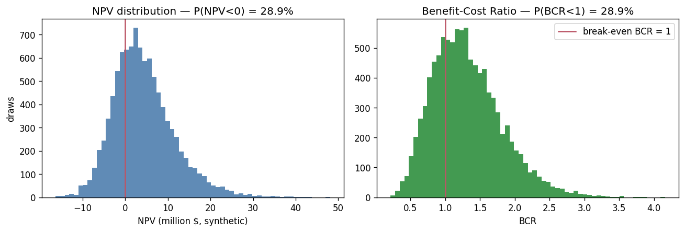
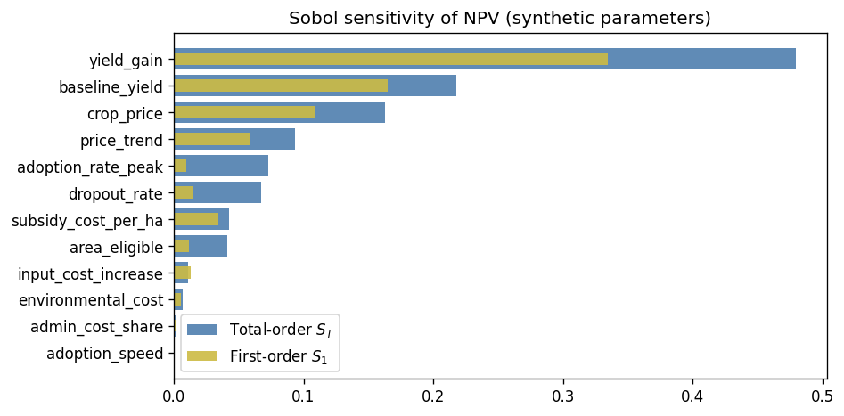
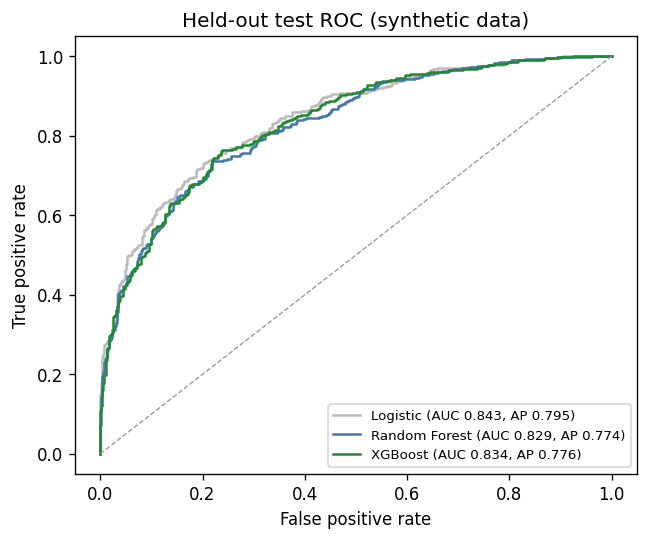
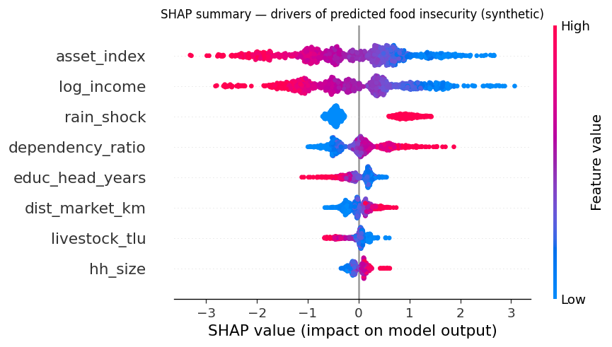

# Method Demos

Self-contained, fully reproducible demonstrations of the quantitative methods I used in professional work whose data and code are confidential (CIRAD/CGIAR, 2025). Each notebook generates its own synthetic data in the first cell, runs end-to-end in about a minute with fixed seeds, and is explicit about what is demonstrated (the method) versus what is not (the real-world results).

| Notebook | Method | Mirrors |
|---|---|---|
| [`monte_carlo_cost_benefit.ipynb`](monte_carlo_cost_benefit.ipynb) | Monte Carlo simulation (10,000 draws), NPV & benefit-cost-ratio distributions, Sobol sensitivity indices (SALib) | Agricultural subsidy cost-benefit analysis presented to 20+ CGIAR member organisations |
| [`food_insecurity_ml_pipeline.ipynb`](food_insecurity_ml_pipeline.ipynb) | Logistic baseline vs tuned Random Forest / XGBoost, stratified k-fold CV, held-out ROC-AUC, SHAP interpretability | FIES Mali food-insecurity prediction (AUC 0.87 on the confidential survey data) |






**Why demos instead of the real code?** The underlying analyses belong to CIRAD/CGIAR and use non-distributable survey data. Rather than link project claims to code that cannot be shown, these notebooks reproduce the *methods* on synthetic data — every technique named in the project descriptions can be read, run, and checked here.

A third professional project (the 9-country SurveyCTO data pipeline) is not demoed because its value lies in operational orchestration rather than a reproducible algorithm; its methods are described in the project documentation on my [portfolio](https://tchiofoubruel-prog.github.io/Portfolio-Data-Analyst-/).

## Run

```bash
pip install numpy pandas matplotlib scikit-learn xgboost shap SALib
jupyter lab
```
